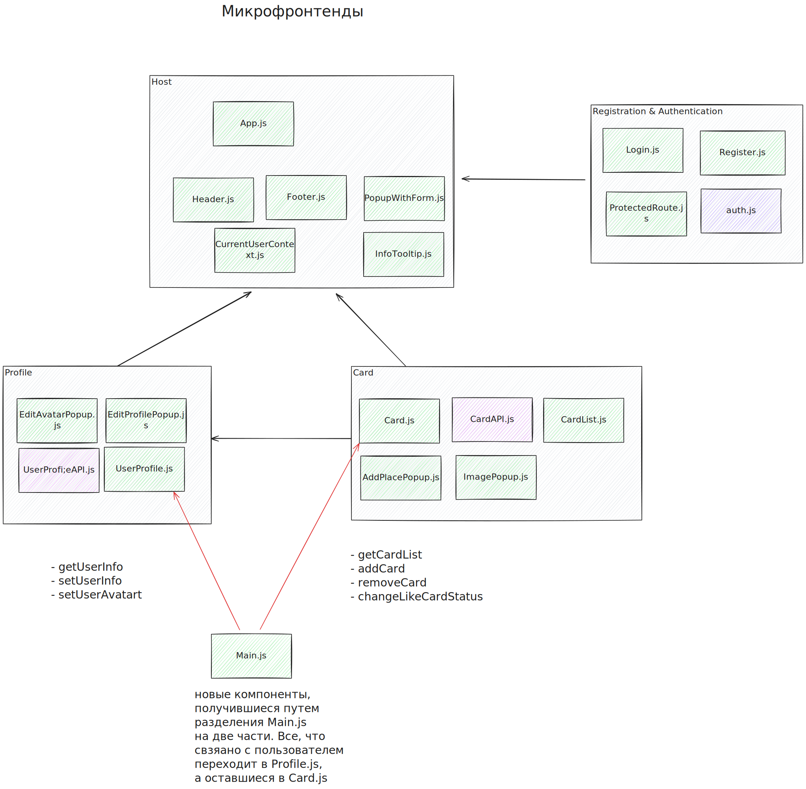

# Microfrontends

## Обоснование использования Webpack Module Federation

1. Приложение полностью написано на React, с большим количеством общих зависимостей.
	- Поскольку приложение написано на одном фреймворке (React), потребности в поддержке множественных фреймворков, которые обеспечивает Single SPA, здесь нет. Webpack Module Federation идеально подходит для сценариев с большим количеством общих зависимостей, таких как React-библиотеки и UI-компоненты.
	- Webpack MF позволяет легко делить общие библиотеки между микрофронтендами, минимизируя дублирование кода и экономя ресурсы. Это особенно важно для молодых приложений, где требуется создание общей базы компонентов для переиспользования в разных частях.

2. Простая маршрутизация, реализованная через react-router-dom.
	- В текущем приложении используется простая маршрутизация через react-router-dom, что делает Single SPA избыточным. Этот фреймворк особенно полезен в сложных приложениях с гибкой маршрутизацией, где каждый микрофронтенд может быть независимым приложением на отдельном фреймворке.
	- Ленивая загрузка: Оба подхода поддерживают lazy-загрузку, поэтому с точки зрения оптимизации загрузки Webpack MF будет справляться ничуть не хуже.

3. Необходимость SEO.
    - SEO — это слабая сторона Single SPA из-за динамического контента, который этот фреймворк загружает по запросу, а не сразу. Webpack MF позволяет лучше организовать структуру приложения для поисковых систем, так как каждая часть может быть статически проиндексирована (при необходимости). Это особенно важно для роста пользовательской базы, зависящего от видимости в поисковых системах.

4. Уменьшение инфраструктурных усилий.
	- Single SPA требует больше инфраструктурных ресурсов для настройки и развертывания. Webpack MF значительно проще в управлении, так как позволяет избежать необходимости развёртывать каждый микрофронтенд как отдельное приложение, что снижает инфраструктурные затраты и упрощает развертывание.


### Вывод и рекомендации

Выделение компонентов на микрофронтенды с помощью Webpack Module Federation даёт следующие преимущества:
	- Оптимизация производительности и ресурсов за счёт шеринга компонентов.
	- Снижение инфраструктурных затрат, так как нет необходимости в настройке независимых приложений для каждого микрофронтенда.
	- Улучшение SEO за счёт предсказуемой структуры и возможности работать со статическим контентом.


### Возможная комбинация Webpack MF и Single SPA

Возможно, со временем, при добавлении микрофронтендов с динамическим контентом и требованиями к сложной маршрутизации, нам потребуется гибкость, которую даёт Single SPA. В этом случае Webpack Module Federation может продолжать отвечать за управление и шаринг библиотек и компонентов, а Single SPA можно будет добавить для управления маршрутизацией и динамической подгрузкой независимых модулей.


## Структура проекта, разделенного на микрофронтенды

Перед тем, как разбить монолит на микрофронтенды был проведен анализ свяанности компонент. Она полуилась такая, как представлена на картинке:


После этого, было принято решение разделить фронтенд на следюущие микрофронтенды:
```
frontend/
├── microfrontends/
│   ├── auth/
│   │   ├── src/
│   │   │   ├── components/
│   │   │   │   ├── Login.js                // Компонент для авторизации
│   │   │   │   ├── Register.js             // Компонент для регистрации
│   │   │   │   └── ProtectedRoute.js       // Компонент для защиты маршрутов
│   │   │   ├── utils/
│   │   │   │   └── auth.js                 // API для регистрации и авторизации
│   │   │   ├── index.js                    // Точка входа для микрофронтенда
│   │   │   ├── App.jsx                     // Основной компонент микрофронтенда
│   │   ├── public/
│   │   │   └── index.html                  // HTML-файл для запуска микрофронтенда
│   │   ├── package.json                    // Файл зависимостей для микрофронтенда Auth
│   │   ├── package-lock.json
│   │   └── webpack.config.js               // Конфигурация Webpack для Auth
│
│   ├── profile/
│   │   ├── src/
│   │   │   ├── components/
│   │   │   │   ├── UserProfile.js          // Компонент профиля пользователя
│   │   │   │   ├── EditProfilePopup.js     // Модальное окно для редактирования профиля
│   │   │   │   └── EditAvatarPopup.js      // Модальное окно для изменения аватара
│   │   │   ├── utils/
│   │   │   │   └── profileApi.js           // API для получения и изменения данных профиля
│   │   │   ├── index.js                    // Точка входа для микрофронтенда
│   │   │   ├── App.jsx                     // Основной компонент микрофронтенда
│   │   ├── public/
│   │   │   └── index.html                  // HTML-файл для запуска микрофронтенда
│   │   ├── package.json                    // Файл зависимостей для микрофронтенда Profile
│   │   ├── package-lock.json
│   │   └── webpack.config.js               // Конфигурация Webpack для Profile
│
│   ├── card/
│   │   ├── src/
│   │   │   ├── components/
│   │   │   │   ├── CardList.js             // Список карточек
│   │   │   │   ├── Card.js                 // Отдельная карточка
│   │   │   │   ├── AddPlacePopup.js        // Модальное окно для добавления карточки
│   │   │   │   └── ImagePopup.js           // Модальное окно для просмотра изображения
│   │   │   ├── utils/
│   │   │   │   └── cardApi.js              // API для работы с карточками (получение, добавление, удаление, лайки)
│   │   │   ├── index.js                    // Точка входа для микрофронтенда
│   │   │   ├── App.jsx                     // Основной компонент микрофронтенда
│   │   ├── public/
│   │   │   └── index.html                  // HTML-файл для запуска микрофронтенда Card
│   │   ├── package.json                    // Файл зависимостей для микрофронтенда Card
│   │   ├── package-lock.json
│   │   └── webpack.config.js               // Конфигурация Webpack для Card
│
├── src/
│   ├── blocks/
│   ├── components/
│   │   ├── Header.js                       // Глобальный компонент заголовка
│   │   ├── Footer.js                       // Глобальный компонент футера
│   │   ├── InfoTooltip.js                  // Универсальный компонент уведомлений
│   │   └── PopupWithForm.js                // Универсальный шаблон модального окна
│   ├── contexts/
│   │   └── CurrentUserContext.js           // Глобальный контекст для данных пользователя
│   ├── blocks/
│   ├── public/
│   ├── vendor/
│   ├── images/
│   ├── App.jsx                             // Основной компонент host-приложения
│   ├── index.js                            // Точка входа для host-приложения
│   ├── index.css
│   └── serviceWorker.js
├── package.json                            // Файл зависимостей host-приложения
├── package-lock.json
└── webpack.config.js                       // Конфигурация Webpack для host-приложения
```

### Host-приложение

**Описание:** Host-приложение является основным контейнером, который координирует работу всех микрофронтендов, управляет глобальным контекстом и предоставляет общие компоненты.

**Причина выделения:** Host-приложение объединяет все микрофронтенды в одно целое, сохраняя глобальные состояния и обеспечивая навигацию между модулями.

**Детали:**
    - App.js: Центральный компонент, организующий маршрутизацию и подгрузку микрофронтендов. Он служит контейнером для всех микрофронтендов и координирует их взаимодействие.
	- CurrentUserContext.js: Глобальный контекст, предоставляющий данные о текущем пользователе. Должен находиться в host, так как используется во всех микрофронтендах (например, для отображения информации профиля и действий с карточками).
	- Header.js: Глобальный компонент для навигации и отображения базовой информации о пользователе. Логично оставить его в host, так как он видим на всех страницах и не привязан к конкретному функционалу.
	- Footer.js: Как и Header, является общим для всего приложения, поэтому должен находиться в host.
    - InfoTooltip.js: Универсальный компонент для отображения уведомлений об успехах или ошибках. Оставляем в host, чтобы обеспечить доступность во всех микрофронтендах.
	- PopupWithForm.js: Шаблонный компонент для создания модальных окон. Поскольку он используется в разных микрофронтендах, логично хранить его в host для переиспользования.

### Микрофронтенд Auth (Authentication & Registration)

**Описание:** Этот микрофронтенд отвечает за функциональность, связанную с авторизацией и регистрацией пользователей, а также за контроль доступа к защищённым маршрутам через ProtectedRoute.

**Причина выделения:** Процессы аутентификации и регистрации требуют специфических компонентов и API, которые могут работать независимо от других частей приложения. Это позволяет легко обновлять и управлять функционалом авторизации, не затрагивая другие модули.

**Детали:**
    - Login.js: Компонент для авторизации пользователей. Относится к Auth, так как является частью процесса аутентификации.
	- Register.js: Компонент для регистрации новых пользователей. Как и Login, входит в Auth, так как связан с регистрацией и авторизацией.
	- ProtectedRoute.js: Компонент для защиты маршрутов, перенаправляющий неавторизованных пользователей. Логично оставить в Auth, так как его задача — проверка состояния аутентификации.
	- auth.js: API для работы с аутентификацией (регистрация, вход, проверка токена). Логично хранить его в Auth, так как он обслуживает только процессы авторизации и регистрации.

### Микрофронтенд Profile

**Описание:** Этот микрофронтенд управляет профилем пользователя, предоставляя функционал для отображения, редактирования профиля и изменения аватара.

**Причина выделения:** Функциональность профиля пользователя логически изолирована от других частей приложения, и её можно развивать независимо. Выделение Profile позволяет упростить работу с информацией о пользователе и облегчает интеграцию с другими частями приложения через общий CurrentUserContext.

**Детали:**
    - UserProfile.js: Компонент для отображения информации профиля пользователя, включая аватар и описание. Выносится в Profile, так как связан исключительно с функционалом профиля. Этот компонент был создан после разделения компонента Main.js
	- EditProfilePopup.js: Модальное окно для редактирования информации профиля. Является частью Profile, так как относится к управлению данными пользователя.
	- EditAvatarPopup.js: Модальное окно для изменения аватара пользователя. Также относится к Profile, так как это часть интерфейса управления профилем.
	- UserProfileAPI.js:
        - getUserInfo: API для получения информации о текущем пользователе. Входит в Profile, так как используется для загрузки данных профиля.
	    - setUserInfo: API для обновления информации о пользователе. Относится к Profile, так как отвечает за изменение данных профиля.
	    - setUserAvatar: API для обновления аватара пользователя. Логично оставить в Profile, так как он используется для изменения данных профиля.

### Микрофронтенд Card

**Описание:** Этот микрофронтенд отвечает за управление основным контентом приложения — карточками.

**Причина выделения:** Логика управления контентом (карточками) достаточно объёмна и независима от других частей приложения. Выделение Card позволяет сосредоточиться на обработке и отображении карточек, что упрощает добавление нового функционала и улучшает производительность.

**Детали:**
    - CardList.js: Компонент для отображения списка карточек. Выносится в Feed, так как отвечает за отображение и управление основным контентом — карточками.
	- Card.js: Компонент для отображения отдельной карточки. Является частью Feed, так как это основной элемент, отображаемый в списке карточек.
	- AddPlacePopup.js: Модальное окно для добавления новой карточки. Является частью Feed, так как это действие относится к управлению карточками.
	- ImagePopup.js: Модальное окно для просмотра изображения карточки. Логично отнести его к Feed, так как оно используется для отображения контента карточек.
	- CardAPI.js
        - getCardList: API для получения списка карточек. Включается в Feed, так как обеспечивает доступ к основному контенту — карточкам.
	    - addCard: API для добавления новой карточки. Относится к Feed, так как используется для добавления нового контента в список карточек.
	    - removeCard: API для удаления карточки. Логично оставить в Feed, так как этот метод связан с управлением карточками.
	    - changeLikeCardStatus: API для установки или удаления лайка. Включается в Feed, так как используется для управления взаимодействием с карточками.
    

Визуально архитектуру приложения на микрофронтеде выглядит следующим образом:
